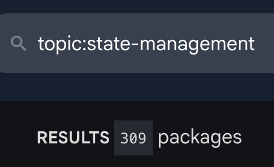
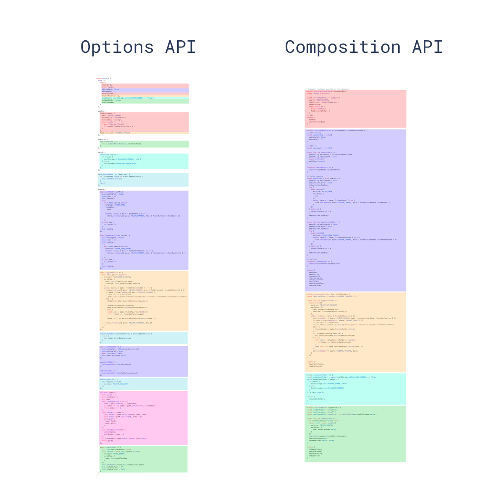
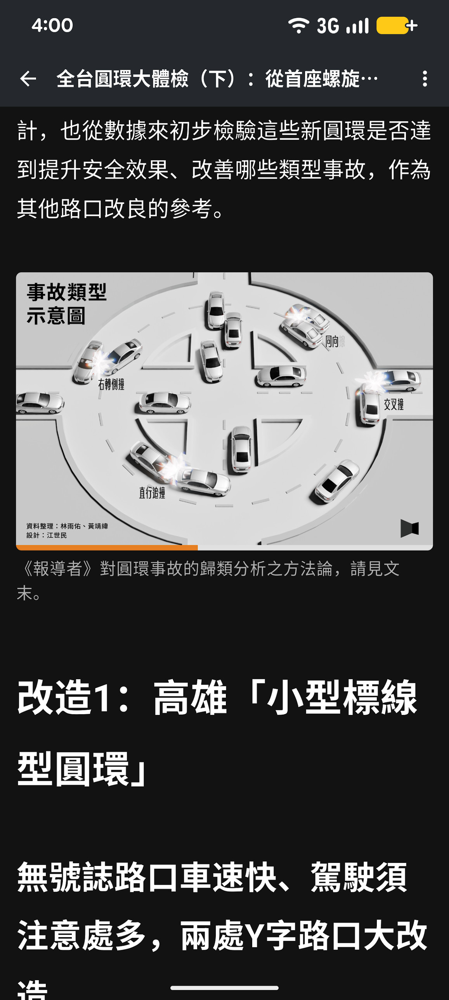
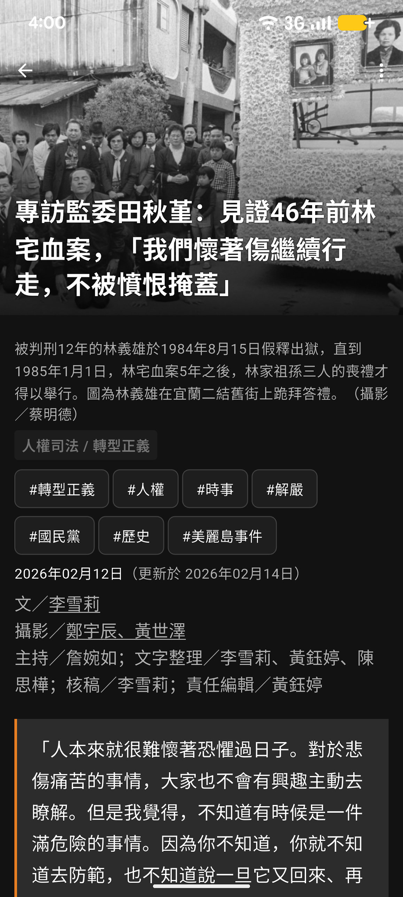

# 如何在 Flutter 裡<br/>引入 Vue Composition API ?

<div class="mt-12 text-xl opacity-80">
IU&nbsp;・&nbsp;<span class="opacity-60">@yoyo930021</span>
</div>

<div class="mt-2 text-sm opacity-50">
Flutter Taipei Meetup&nbsp;·&nbsp;2026-04-28
</div>

<div class="abs-br m-6 flex items-end gap-4">
  <div class="text-right text-xs opacity-70">
    簡報連結
  </div>
  
</div>

<!--
- 自我介紹（30 sec）：IU，前端工程師
- 今天要講一個有點離經叛道的事：把 Vue 的東西帶進 Flutter
- 簡報網址在 QR code，跟著一起翻沒問題
-->

---
layout: section
---

# Part 1
## 緣起

---
layout: two-cols-header
---

# Hi, 我是 IU

::left::

<div class="mt-6 space-y-3">
  <div>👨‍💻 前端工程師&nbsp;·&nbsp;Vue 重度使用者</div>
  <div>💚 曾經的 Vue 貢獻者</div>
  <div>📱 最近開始碰 Flutter</div>
  <div>🎤 COSCUP 志工</div>
  <div>🐙 <span class="text-blue-400">@yoyo930021</span></div>
</div>

::right::

<div class="flex justify-center mt-2">
  
</div>

<!--
- 我是 IU，前端工程師
- 主要寫 Vue，曾經給 Vue 上游送過 PR
- 最近一年開始碰 Flutter
- 也是 COSCUP 的常客（這張就是 COSCUP 拍的）
- 今天的故事就從這裡開始
-->

---

# 第一次寫 Flutter

```dart {all|3,5|7-11|12-16|17-22|24|all}
class Counter extends StatefulWidget {
  @override
  State<Counter> createState() => _CounterState();   // 拆出 State 類別
}
class _CounterState extends State<Counter> {
  int count = 0;
  @override
  void initState() {                                 // 初始化在這
    super.initState();
    _controller = ScrollController()..addListener(_onScroll);
  }
  @override
  void didUpdateWidget(Counter old) {                // props 變化追蹤在這
    super.didUpdateWidget(old);
    if (widget.userId != old.userId) reload();
  }
  @override
  void dispose() {                                   // 清理在這
    _controller.removeListener(_onScroll);
    _controller.dispose();
    super.dispose();
  }
  @override
  Widget build(BuildContext context) => Text('$count');  // 渲染在這
}
```

<!--
- 第一個感受：同一個 feature 的程式碼分散在 4-5 個 lifecycle hook
- initState 初始化、dispose 清理、didUpdateWidget 偵測 props、build 渲染
- 對 Vue 開發者來說有點想念 setup() — 一個函數搞定
-->

---
layout: two-cols-header
---

# 但 Flutter 已經有<br/>**很多** state management 選項

::left::

<div class="flex justify-center mt-4">
  
</div>

<div class="text-center text-xs opacity-60 mt-2">
pub.dev <code>topic:state-management</code>
</div>

::right::

<div class="flex flex-col justify-center h-full">
  <div v-click class="text-2xl">所以&hellip;</div>
  <div v-click class="text-3xl text-orange-400 font-bold mt-2">
    我又做了一個 😅
  </div>
</div>

<!--
- pub.dev 上 topic:state-management 有 309 個套件
- setState、Provider、Riverpod、BLoC、Redux、GetX、MobX、flutter_hooks、Signals…
- 真的很多，每個都各有擁護者
- 所以理論上不該再多一個... 但我還是做了
- 接下來解釋為什麼
-->

---
layout: two-cols-header
---

# 兩個關鍵相遇

::left::

<div class="mt-8">
<div class="text-2xl font-bold mb-2">flutter_hooks</div>
<div class="opacity-70">React Hooks 的 Flutter 版</div>
<div class="mt-2 text-sm opacity-60">「原來 Flutter 也能脫離 StatefulWidget」</div>
</div>

::right::

<div class="mt-8">
<div class="text-2xl font-bold mb-2">alien_signals</div>
<div class="opacity-70">Vue 3 reactivity 的 Dart 版</div>
<div class="mt-2 text-sm opacity-60">「ref / computed / effect 都齊了」</div>
</div>

<div v-click class="col-span-2 mt-12 text-center text-2xl">
👉 兩個合起來 = Vue Composition API 的 Flutter 版
</div>

<!--
- 直到我看到兩個套件
- flutter_hooks 啟發我「Flutter 也能脫離 StatefulWidget」
- alien_signals 是 Vue 3 reactivity 的 Dart 移植
- 兩個合起來，剛好就是 Vue Composition API 缺的拼圖
-->

---

# 為什麼是 Composition API ?

<div class="text-xs mt-2">

| | StatefulWidget | flutter_hooks | Composition API |
|---|---|---|---|
| 心智模型 | lifecycle hooks 分散 | React Hooks | Vue `setup()` |
| state 宣告 | `initState` | `useState`（每次 build） | `setup` 一次 |
| rebuild 範圍 | `setState` 整子樹 | 整個 `build` 重跑 | 細粒度（讀到 ref 才重跑） |
| Rules of Hooks | — | ✓ 必須遵守 | — |

</div>

<div class="mt-6 text-center text-sm">
flutter_hooks 解決「<span class="opacity-70">關注點分散</span>」<br/>
Composition API 多解決<span class="text-green-400">「細粒度更新」</span>與<span class="text-green-400">「Rules of Hooks 限制」</span>
</div>

<!--
- StatefulWidget 的問題大家都知道：lifecycle 分散、setState rebuild 整子樹
- flutter_hooks 解決了「關注點分散」 — 但
  - hook 必須遵守 Rules of Hooks（不能在條件 / 迴圈裡 useState）
  - rebuild 還是整個 build 重跑（沒有細粒度）
- Composition API 的差別：
  - setup() 只跑一次 — 沒有 Rules of Hooks 問題（可以在條件中宣告 ref）
  - ref / computed 訂閱機制 — 細粒度只重跑讀到變更的 builder
- 所以選擇 Composition API：解決 flutter_hooks 也解決的問題 + 多兩個它沒解決的問題
-->

---

# 同一段邏輯，兩種寫法

<div class="text-xs opacity-60 mb-1 text-center">flutter_compositions：把 Vue 心智模型搬進 Flutter</div>

<div class="grid grid-cols-2 gap-3 text-xs">

<div>

**StatefulWidget**

```dart
class Counter extends StatefulWidget {...}
class _S extends State<Counter> {
  int count = 0;
  late final ScrollController _ctrl;

  @override
  void initState() {                  // 初始化
    super.initState();
    _ctrl = ScrollController()
      ..addListener(_onScroll);
  }
  @override
  void didUpdateWidget(Counter old) { // props 變化
    super.didUpdateWidget(old);
    if (widget.userId != old.userId) reload();
  }
  @override
  void dispose() {                    // 清理
    _ctrl.removeListener(_onScroll);
    _ctrl.dispose();
    super.dispose();
  }
  @override
  Widget build(BuildContext c) => Text('$count');
}
```

</div>

<div>

**CompositionWidget**

```dart
class Counter extends CompositionWidget {
  @override
  Widget Function(BuildContext) setup() {
    final count = ref(0);
    final ctrl = useScrollController();
    // ↑ 自動清理


    watch(() => widget().userId,
          (id, _) => reload());
    // ↑ props 變化追蹤


    return (c) => Text('${count.value}');
  }
}
```

</div>

</div>

<div class="mt-3 text-center text-sm opacity-70">
4 個 lifecycle hook 分散 → 一個 <code>setup()</code> 函數
</div>

<!--
- 套件叫 flutter_compositions — 把 Vue 心智模型搬進 Flutter
- 同一個 Counter 兩種寫法，左邊 StatefulWidget，右邊 flutter_compositions
- StatefulWidget：State 類別、initState、didUpdateWidget、dispose、build — 4 個 lifecycle hook 分散
- CompositionWidget：一個 setup() 函數
  - useScrollController() 對應 initState + dispose（自動清理）
  - watch(() => widget().userId, ...) 對應 didUpdateWidget
  - return builder 對應 build
- 行數差不多，但心智模型完全不一樣 — 一個函數，一條故事線
-->

---
layout: section
---

# Part 2
## 核心 API 與設計

---
layout: center
---

# 三大原語

<div class="mt-8 grid grid-cols-3 gap-6 text-center">
  <div>
    <div class="text-3xl font-mono text-blue-400">ref()</div>
    <div class="mt-2 opacity-70">響應式狀態</div>
  </div>
  <div>
    <div class="text-3xl font-mono text-green-400">computed()</div>
    <div class="mt-2 opacity-70">衍生 + 快取</div>
  </div>
  <div>
    <div class="text-3xl font-mono text-purple-400">watch()</div>
    <div class="mt-2 opacity-70">副作用</div>
  </div>
</div>

<div class="mt-12 text-center opacity-70">
與 Vue 3 一致 — 寫過 Vue 直接上手
</div>

<!--
- 三個核心 API：ref / computed / watch
- 寫過 Vue 3 的應該不用解釋
- 沒寫過 Vue 的也不用怕，後面會看程式碼
-->

---

# 心智模型：setup() 只跑一次

<div class="grid grid-cols-2 gap-6 mt-2 text-sm">

<div>

**StatefulWidget**

```
build() ────────► N+ 次
 │
 ├ 區域變數每次重建
 ├ 整個子樹一起 rebuild
 └ setState() 觸發
```

每次 `build` 整段重跑

</div>

<div>

**CompositionWidget**

```
setup()  ────────► 1 次
 │
 ├ ref / computed 建立
 ├ effects 註冊到 scope
 └ 回傳 builder
       │
       └► N+ 次 (細粒度)
          只重跑「讀到變更 ref」的部分
```

</div>

</div>

<div class="mt-4 text-center text-sm">
<span class="opacity-60">trade-off：</span>
<span>setup 不能 async</span>&nbsp;·&nbsp;
<span>builder 不放邏輯</span>&nbsp;·&nbsp;
<span>collection 整體替換</span>
</div>

<!--
- 最重要的心智模型差別
- StatefulWidget: build() 跑很多次，所有東西每次重建
- CompositionWidget: setup() 只跑一次，建立 refs 和 effects；builder 才是反覆執行的
- 這帶來的好處：fine-grained — 只重建讀到變更 ref 的部分
- 但帶來的限制：setup 不能 async（要同步回傳 builder）；邏輯都放 setup 不放 builder；collection mutation 不會觸發
- 這些限制後面會看到 lint rule 怎麼幫忙
-->

---

# 自動資源管理

<div class="grid grid-cols-2 gap-4">

<div>

**StatefulWidget**

```dart
late final ScrollController _ctrl;

@override
void initState() {
  super.initState();
  _ctrl = ScrollController();
  _ctrl.addListener(_onScroll);
}

@override
void dispose() {
  _ctrl.removeListener(_onScroll);
  _ctrl.dispose();
  super.dispose();
}
```

</div>

<div>

**CompositionWidget**

```dart
@override
Widget Function(BuildContext) setup() {
  final ctrl = useScrollController();
  // 自動 dispose

  return (c) => ListView(
    controller: ctrl.raw,
    children: [...],
  );
}
```

</div>

</div>

<div class="mt-4 text-center opacity-70 text-sm">
effectScope 隨 widget unmount 自動清理 — 不會漏 dispose
</div>

<!--
- ScrollController 是 Flutter 最常見的「忘記 dispose 就 leak」的東西
- 左邊 6 步：建立、addListener、_onScroll、removeListener、dispose、build
- 右邊 2 步：useScrollController 一行，傳 .raw 給 widget
- 為什麼是 .raw？因為 ctrl.value 會建立響應式訂閱，但 controller 物件本身不會換，這時就用 .raw 拿原始物件
- effectScope：所有 effect 都掛在這個 scope 上，widget unmount 時整個 scope 一起 dispose
-->

---

# 邏輯可重用、可組合

<div class="grid grid-cols-2 gap-3 text-xs">

<div>

**寫好的 composable**

```dart
// 通用 debounce
Ref<T> useDebounced<T>(
  ReadonlyRef<T> src,
  { Duration ms = ... },
) {...}

// 通用 async 狀態
({Ref<T?> data,
  Ref<bool> loading,
  Future<void> Function() run})
useAsync<T>(
  Future<T> Function() fetcher,
) {...}
```

</div>

<div>

**任意組合**

```dart
class SearchPage extends CompositionWidget {
  @override
  Widget Function(BuildContext) setup() {
    final query = ref('');

    final debounced = useDebounced(query);
    final r = useAsync(
      () => api.search(debounced.value),
    );

    watch(() => debounced.value,
          (_, __) => r.run());

    return (c) => ...;
  }
}
```

</div>

</div>

<div class="mt-3 text-center text-sm opacity-70">
傳統做法：mixin / InheritedWidget / 拆 widget — 沒有自然的「邏輯單元」概念
</div>

<!--
- Composition API 最大的好處：邏輯可以變成函數
- 左邊：寫好兩個通用 composable（useDebounced + useAsync）— 純邏輯，沒有 UI
- 右邊：在 SearchPage 裡像積木一樣組合起來
- 跟傳統 Flutter 比：跨 widget 共用邏輯要寫 mixin / InheritedWidget / 拆 widget — 都不夠自然
- Composition API：function = 邏輯單元，可以跨頁面、跨專案重用
- 這也是 Vue Composition API 在前端世界爆紅的原因
-->

---

# 視覺化：按 feature 內聚

<div class="flex justify-center mt-2">
  
</div>

<div class="text-center text-xs opacity-50 mt-2">
來源：vuejs.org
</div>

<!--
- Vue 官網的經典示意圖
- 每一個顏色 = 一個 feature concern（例如：搜尋、分頁、表單驗證）
- 看到沒？同一個 feature 的程式碼是「集中」在一塊，不是散落 lifecycle hook
- 對應到 Flutter：原本 initState 一塊、didUpdateWidget 一塊、dispose 一塊；
  Composition 之後，同一個 feature 的初始化、響應、清理都在一個 composable function 裡
- 這就是「按 feature 組織」vs「按 lifecycle 組織」
-->

---

# DI — 從「Provider Tree」到「Function」

<div class="grid grid-cols-2 gap-4">

<div>

**`providers.dart`** — 一處 provide

```dart
void provideArticleRepository(
  ArticleRepository repo,
) {
  provide(AppKeys.articleRepository, repo);
}

void provideThemeMode(
  Ref<ThemeMode> themeModeRef,
) {
  provide(AppKeys.themeMode, themeModeRef);
}
```

</div>

<div>

**`composables.dart`** — 各處 inject

```dart
ArticleRepository useArticleRepository() =>
    inject(AppKeys.articleRepository);

Ref<ThemeMode> useThemeMode() =>
    inject(AppKeys.themeMode);
```

</div>

</div>

<div class="mt-3 grid grid-cols-2 gap-3 text-xs opacity-70">
  <div>
    傳統：<code>ChangeNotifierProvider</code> 樹包 widget，<br/>跨層用 <code>context.read&lt;T&gt;()</code>
  </div>
  <div>
    Composition：函數即 DI 介面 — 不用傳 <code>context</code>，邏輯可隨意挪動
  </div>
</div>

<!--
- 傳統 Flutter DI：ChangeNotifierProvider / MultiProvider 樹包整個 app，再 context.read<T>() 取
- flutter_compositions：provide(key, value) 在 root 注入，inject(key) 在任何地方取
- 不用傳 context、不用 ChangeNotifierProvider 包來包去
- 而且 useArticleRepository() 是個函數 — 可以塞進任何 composable，不受 widget tree 結構限制
- 設計權衡：用 parent chain 查找（O(d) widget tree depth），不走 InheritedWidget
- 為什麼？InheritedWidget 會觸發整個依賴子樹重建，我們不想要那個成本
-->

---
layout: section
---

# Part 3
## 實戰驗證
### tw_reporter_app

---
layout: center
---

# 為什麼需要驗證專案？

<div class="mt-10 text-xl opacity-90 text-center">
框架自己寫起來都很順
</div>

<div class="mt-4 text-3xl text-center">⬇</div>

<div class="mt-4 text-2xl text-center font-bold">
寫一個 non-trivial 的 app 才知道<br/>API 設計有沒有問題
</div>

<!--
- 框架自己寫起來都很順 — 因為是自己設計的
- 真正的考驗是：拿來寫一個正常規模的 app 會怎樣？
- 所以我做了 tw_reporter_app
-->

---
layout: two-cols-header
---

# 閱報導者

::left::

<div class="mt-2 space-y-2 text-sm">
<div class="text-base">📰 台灣《報導者》非官方客戶端</div>
<div class="opacity-70">全面棄用 StatefulWidget + Provider</div>
<div class="opacity-70">改用 flutter_compositions</div>
<div class="opacity-70">已上架 Google Play</div>
</div>

<div class="mt-6 flex flex-col items-center">
  
  <div class="mt-2 text-xs opacity-70">Google Play</div>
</div>

::right::

<div class="flex justify-center gap-2 mt-2">
  
  
  
</div>

<!--
- tw_reporter_app — 台灣《報導者》的非官方閱讀器
- 全部用 flutter_compositions 寫，沒有用 Provider/Riverpod
- 已經上架 Google Play，掃 QR code 可以下載
- 三張截圖：首頁、文章列表、文章詳情
-->

---

# Async Data — useArticleDetail

```dart {all|3-5|7-16|18|19|all}
ArticleDetailResult useArticleDetail({required String slug}) {
  final repo = useArticleRepository();
  final article = ref<Article?>(null);
  final isLoading = ref(false);
  final hasError = ref(false);

  Future<void> load() async {
    isLoading.value = true;
    try {
      article.value = await repo.fetchById(slug: slug);
    } catch (_) {
      hasError.value = true;
    } finally {
      isLoading.value = false;
    }
  }

  onMounted(load);
  return (article: article, isLoading: isLoading, hasError: hasError, refresh: load);
}
```

<!--
- 一個典型的 async fetch composable
- 三個 ref 管狀態，onMounted 觸發載入
- 回傳 Dart 3 Record，呼叫端解構即用
- 這就是 Vue 開發者熟悉的「自訂 hook」感
- 任何頁面都能 useArticleDetail(slug: 'xxx')，邏輯不重複
-->

---
layout: center
---

# 現在做不到的限制

<div class="mt-6 grid grid-cols-2 gap-x-8 gap-y-4 max-w-4xl mx-auto text-sm">

<div class="border rounded p-3">
  <div class="font-bold mb-1">❌ 元件級細粒度更新</div>
  <div class="opacity-70">builder 內整段一起重建 — 想要 node-level 得手動切 ComputedBuilder</div>
</div>

<div class="border rounded p-3">
  <div class="font-bold mb-1">❌ 響應式層級不同</div>
  <div class="opacity-70">ref / object / collection 都是 shallow — Vue reactive 是 deep</div>
</div>

<div class="border rounded p-3">
  <div class="font-bold mb-1">❌ 跨 Isolate</div>
  <div class="opacity-70">alien_signals 在單一 isolate 運作</div>
</div>

<div class="border rounded p-3">
  <div class="font-bold mb-1">❌ 持久化</div>
  <div class="opacity-70">沒整合 SharedPreferences / Hive — 自己接</div>
</div>

<div class="border rounded p-3">
  <div class="font-bold mb-1">❌ 路由整合</div>
  <div class="opacity-70">go_router / auto_route 自己接</div>
</div>

</div>

<!--
- 不是「不做」，是「目前還沒做到」
- 元件級細粒度：builder 一動就整個 widget tree 重跑；想要 SolidJS 那種 node-level 還沒實現
- 響應式層級不同：alien_signals 不做 deep proxy，collection/object 是 shallow，必須整體替換
- 跨 isolate：alien_signals 在單一 isolate 運作
- 持久化、路由整合：套件刻意不碰，留給生態系
-->

---
layout: center
---

# 從實戰中歸納的「雷」

<div class="mt-6 grid grid-cols-2 gap-3 text-sm">
  <div class="border-l-4 border-orange-400 pl-3">
    <div class="font-mono text-orange-400">ensure_reactive_props</div>
    <div class="opacity-70">props 必經 widget()</div>
  </div>
  <div class="border-l-4 border-orange-400 pl-3">
    <div class="font-mono text-orange-400">no_logic_in_builder</div>
    <div class="opacity-70">邏輯放 setup()</div>
  </div>
  <div class="border-l-4 border-orange-400 pl-3">
    <div class="font-mono text-orange-400">prefer_raw_controller</div>
    <div class="opacity-70">controller 用 .raw</div>
  </div>
  <div class="border-l-4 border-orange-400 pl-3">
    <div class="font-mono text-orange-400">no_async_setup</div>
    <div class="opacity-70">setup 不能 async</div>
  </div>
  <div class="border-l-4 border-orange-400 pl-3">
    <div class="font-mono text-orange-400">shallow_reactivity</div>
    <div class="opacity-70">collection 整體替換</div>
  </div>
  <div class="border-l-4 border-orange-400 pl-3 opacity-60">
    <div class="font-mono">⋯ 等 7 條</div>
  </div>
</div>

<div class="mt-8 text-center text-xl">
易犯錯 → <span class="text-green-400">編譯期警告</span>
</div>

<!--
- 寫 tw_reporter_app 過程踩到的雷
- 例如 props 沒包 widget() 就只有初始值
- 這些雷都做成 lint rule，IDE 直接警告
- 7 條規則，把「實戰歸納的 best practice」變成「靜態分析自動化」
-->

---
layout: center
---

# 🤖 Lint Rules 的源頭

<div class="mt-10 text-2xl text-center">
我和 AI 對話中發現的「易犯錯」
</div>

<div class="mt-4 text-3xl text-center">⬇</div>

<div class="mt-4 text-2xl text-center">
歸納成 best practices
</div>

<div class="mt-4 text-3xl text-center">⬇</div>

<div class="mt-4 text-2xl text-center text-green-400 font-bold">
寫成靜態分析規則
</div>

<!--
- Lint rules 不是憑空想出來的
- 是和 AI 一起寫程式時，AI 一直犯同樣的錯（例如 props 沒包 widget()）
- 我意識到「如果連 AI 都會犯，那真人開發者一定也會」
- 把這些錯誤模式變成 lint rule
- 這也順勢帶到下一段：AI 在這個專案裡到底扮演什麼角色
-->

---
layout: section
---

# Part 4
## AI 在這之中的角色

---
layout: center
---

# 一個人怎麼可能維護<br/>這麼多東西？

<v-clicks>

<div class="mt-8 grid grid-cols-2 gap-x-12 gap-y-3 text-lg max-w-2xl mx-auto">
  <div>📦 套件本體</div>
  <div>🔍 Lint rules 套件</div>
  <div>📚 雙語文件 (en/zh)</div>
  <div>🤖 LLM-friendly docs</div>
  <div>📱 範例 app (Google Play)</div>
  <div>🎤 這份簡報</div>
</div>

<div class="mt-12 text-3xl text-center font-bold">
答案：和 AI 一起做
</div>

</v-clicks>

<!--
- 套件本體、lints、雙語文件、範例 app、這份簡報...
- 一個人正常工作時間做不完
- 答案是 AI 幫了非常多
- 接下來看 AI 在每個環節做了什麼
-->

---

# AI 在每個環節

<div class="mt-4 grid grid-cols-2 gap-3 text-sm">
  <div class="border-l-4 border-blue-400 pl-3 py-1">
    <div class="font-bold">架構討論</div>
    <div class="opacity-70">trade-off 對齊（v0.2.0 重構）</div>
  </div>
  <div class="border-l-4 border-red-400 pl-3 py-1">
    <div class="font-bold">Bug 追根究柢</div>
    <div class="opacity-70">症狀 → 根因（不只修表面）</div>
  </div>
  <div class="border-l-4 border-green-400 pl-3 py-1">
    <div class="font-bold">歸納易犯錯</div>
    <div class="opacity-70">→ Lint Rules 7 條</div>
  </div>
  <div class="border-l-4 border-yellow-400 pl-3 py-1">
    <div class="font-bold">雙語文件</div>
    <div class="opacity-70">en / zh 同步維護</div>
  </div>
  <div class="border-l-4 border-purple-400 pl-3 py-1">
    <div class="font-bold">llms-full.txt</div>
    <div class="opacity-70">讓其他 AI 正確使用此套件</div>
  </div>
  <div class="border-l-4 border-orange-400 pl-3 py-1">
    <div class="font-bold">這份簡報</div>
    <div class="opacity-70">講綱、code 範例、排版</div>
  </div>
</div>

<!--
- 從一個想法開始
- 架構討論：和 AI 把 trade-off 攤開（StatefulWidget vs StatelessWidget+Element）
- Bug：把症狀問到根因，不只修表面
- 歸納易犯錯 → 變成 lint rules
- 雙語文件英中同步維護
- llms-full.txt 讓其他 AI 也能正確使用這個套件 — 框架在訓練資料外，但 LLM 能讀文件
- 連這份簡報也是 AI 協作 — 講綱、demo 設計、排版
-->

---
layout: center
---

# 一個有趣的副作用

<div class="mt-8 text-xl opacity-90">
框架在 LLM 訓練資料<span class="text-red-400 font-bold">外</span>
</div>

<div class="mt-4 text-3xl">⬇</div>

<div class="mt-4 text-2xl">
但有 <code class="text-purple-400">llms-full.txt</code>
</div>

<div class="mt-4 text-3xl">⬇</div>

<div class="mt-4 text-xl text-green-400 font-bold">
其他 AI 也能正確使用這個套件
</div>

<!--
- 一個有趣的觀察
- 因為太新，LLM 不認識這個套件
- 但我把整套文件壓成 llms-full.txt
- 使用者把這個檔案丟給 AI，AI 就能正確使用我的套件
- 開源 + AI 時代的新型態文件
-->

---
layout: end
---

# 不是要取代誰<br/>是另一個選項

<div class="mt-12 grid grid-cols-3 gap-6 text-center">
  <div class="flex flex-col items-center">
    
    <div class="mt-2 text-sm opacity-80">pub.dev</div>
  </div>
  <div class="flex flex-col items-center">
    
    <div class="mt-2 text-sm opacity-80">GitHub</div>
  </div>
  <div class="flex flex-col items-center">
    
    <div class="mt-2 text-sm opacity-80">Google Play</div>
  </div>
</div>

<div class="mt-12 text-lg opacity-80">
IU&nbsp;・&nbsp;<span class="text-blue-400">@yoyo930021</span>&nbsp;・&nbsp;Q&amp;A
</div>

<!--
- 結論
- 不是要取代誰
- Vue 背景的人立刻上手；重度 Riverpod/BLoC 的團隊切換成本高
- 三個 QR code：pub.dev / GitHub / Google Play
- 歡迎 issue、PR
- Q&A 時間
-->
